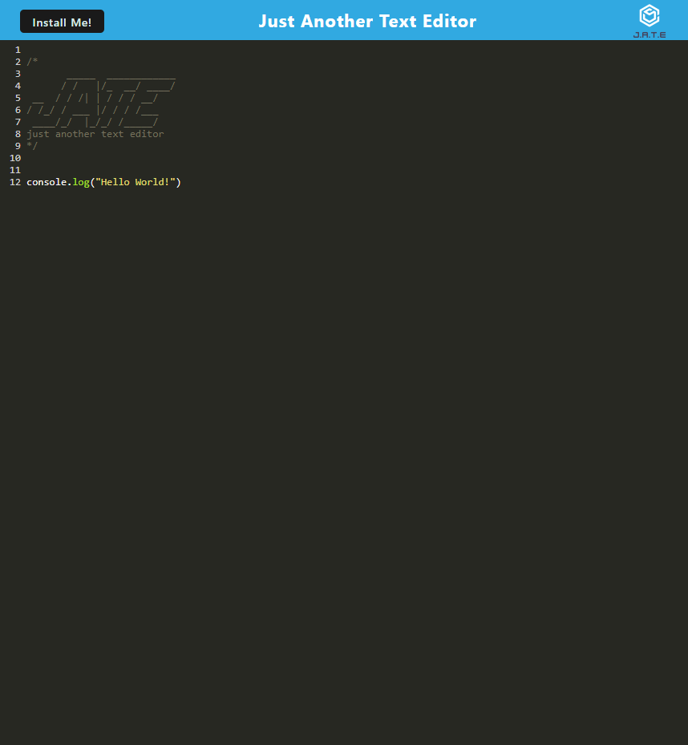

# pwa-text-editor

## Description

This is a Progressive Web Application (PWA) in the form of a text editor. You will be able to use it either on the browser or offline. Enjoy!

## Table of Contents

- [Description](#description)
- [Installation](#installation)
- [Usage](#usage)
- [License](#license)
- [Contribution](#contribution)
- [Tests](#tests)
- [Questions](#questions)

## Installation

For this application to work, you just need an internet connection and a device with a browser.

## Usage

Once you've accessed the deployed application on Heroku, you may use it in the browser or install it to be used offline on your device.

Screenshot:

## License

The license this project is under is MIT. For more information, please click the link below:

https://opensource.org/licenses/MIT

## Contribution

Feel free to reach out to me on GitHub.

## Tests

Clone my code and run the application on your own.

## Questions

Any Questions? You can email me at willjaramillo30@gmail.com
Or, reach out to me on GitHub at https://github/willj30
